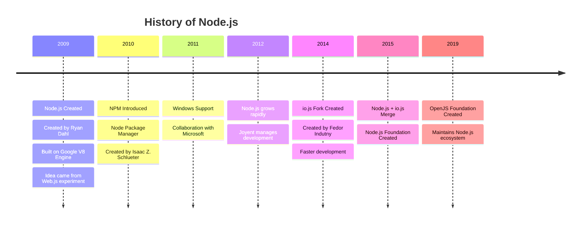

---

# 🧠 Node.js History Diagram



---

## Introduction to Node.js

---

# 🚀 What is Node.js

**Node.js** is an **open-source, cross-platform JavaScript runtime environment** that allows developers to run **JavaScript outside the browser**.

It is built on **V8 JavaScript Engine** which is developed by **Google**.

Node.js is mainly used for:

* Backend development
* APIs
* Real-time applications
* Microservices
* Streaming services

---

# 🕰️ Complete History of Node.js

## 🔹 2009 — Birth of Node.js

In **2009**, **Ryan Dahl** created **Node.js**.

Before Node.js, Ryan Dahl was working with **blocking web servers**, which caused performance issues when handling many users.

Traditional servers like **Apache HTTP Server** used a **thread-per-request model**, meaning every request created a new thread.

This approach had problems:

❌ High memory usage
❌ Slow performance under heavy load
❌ Poor scalability

To solve this, Ryan Dahl built Node.js using:

* **Event-driven architecture**
* **Non-blocking I/O**
* **Single-threaded event loop**

This made Node.js extremely efficient for **real-time applications**.

---

# 🌐 The Idea Before Node.js – Web.js

Before creating Node.js, Ryan Dahl experimented with a project called **Web.js**.

The idea was to build a **web server using JavaScript**.

At that time, JavaScript engines like **SpiderMonkey** (created by **Mozilla**) existed, but they were mainly designed for browsers.

Ryan initially tried building Web.js using SpiderMonkey, but it had limitations:

❌ Slow performance
❌ Not optimized for server workloads
❌ Difficult asynchronous handling

So he looked for a faster engine.

---

# ⚡ Discovery of the V8 Engine

In **2008**, **Google** released the **V8 JavaScript Engine** for **Google Chrome**.

V8 was extremely fast because it:

* Compiles JavaScript into **machine code**
* Uses **Just-In-Time (JIT) compilation**
* Optimizes memory and execution speed

Ryan Dahl realized that **V8 could power a high-performance JavaScript server runtime**.

So he built **Node.js on top of V8**.

---

# 🏢 Joyent Supports Node.js

After Node.js was created, the company **Joyent** adopted the project.

Joyent played a major role in:

* Hosting the Node.js project
* Funding development
* Growing the ecosystem

During this time, **Ryan Dahl** worked at Joyent and continued improving Node.js.

---

# 📦 2010 — Introduction of NPM

In **2010**, **npm** (Node Package Manager) was introduced.

npm was created by **Isaac Z. Schlueter**.

npm allowed developers to:

* Install packages
* Share open-source libraries
* Manage project dependencies

Example:

```bash
npm install express
```

Today npm is **the largest package registry in the world**.

---

# 🪟 2011 — Windows Support (Microsoft Collaboration)

Initially, Node.js worked mainly on **Linux and macOS**.

In **2011**, **Microsoft** collaborated with the Node.js community to add **Windows support**.

This was a huge milestone because it allowed:

✔ Windows developers to use Node.js
✔ Enterprise adoption
✔ Wider developer ecosystem

---

# 🔀 2014 — Fork of Node.js (io.js)

Around **2014**, development of Node.js slowed down under **Joyent**.

Some developers wanted:

* Faster releases
* Open governance
* Community-driven development

So **Fedor Indutny** created a fork of Node.js called **io.js**.

Key improvements in io.js:

✔ Faster development cycle
✔ Latest **V8 engine updates**
✔ Open source governance model

This created two parallel projects:

1️⃣ Node.js
2️⃣ io.js

---

# 🤝 2015 — Node.js & io.js Merge

In **September 2015**, the two projects decided to **merge back together**.

The community created the **Node.js Foundation** to manage the project.

Benefits of the merge:

✔ Unified community
✔ Faster innovation
✔ Better governance model

---

# 🌍 2019 — Creation of OpenJS Foundation

In **2019**, the **Node.js Foundation** merged with the **JS Foundation**.

This created the **OpenJS Foundation**.

The OpenJS Foundation now supports important JavaScript projects like:

* **Node.js**
* **jQuery**
* **Electron**

---

# ⚙️ Key Features of Node.js

### 1️⃣ Non-Blocking I/O

Handles thousands of requests efficiently.

### 2️⃣ Event-Driven Architecture

Uses an **event loop**.

### 3️⃣ Single Threaded

But handles multiple concurrent operations.

### 4️⃣ Fast Execution

Powered by **V8 Engine**.

---

# 📊 Simple Architecture

```
Client Request
    │
    ▼
Node.js Server
(Event Loop)
    │
    ▼
Non Blocking I/O
    │
    ▼
Database / File System
```

---

# 📊 Quick Timeline

| Year | Event                          |
| ---- | ------------------------------ |
| 2009 | Node.js created by Ryan Dahl   |
| 2010 | npm introduced                 |
| 2011 | Windows support with Microsoft |
| 2014 | io.js fork created by Fedor    |
| 2015 | Node.js & io.js merged         |
| 2019 | OpenJS Foundation created      |

---

# 📚 Summary

The evolution of **Node.js** involved many important technologies and contributors:

* **Ryan Dahl** → Created Node.js
* **SpiderMonkey** → Early JavaScript engine experiment
* **Web.js** → Early server experiment
* **V8 JavaScript Engine** → Made Node.js fast
* **Joyent** → Hosted early Node.js development
* **Microsoft** → Helped bring Windows support
* **Fedor Indutny** → Created **io.js** fork
* **OpenJS Foundation** → Maintains Node.js today

Today, Node.js powers **millions of servers, APIs, and real-time applications worldwide**. 🌍🚀

---
