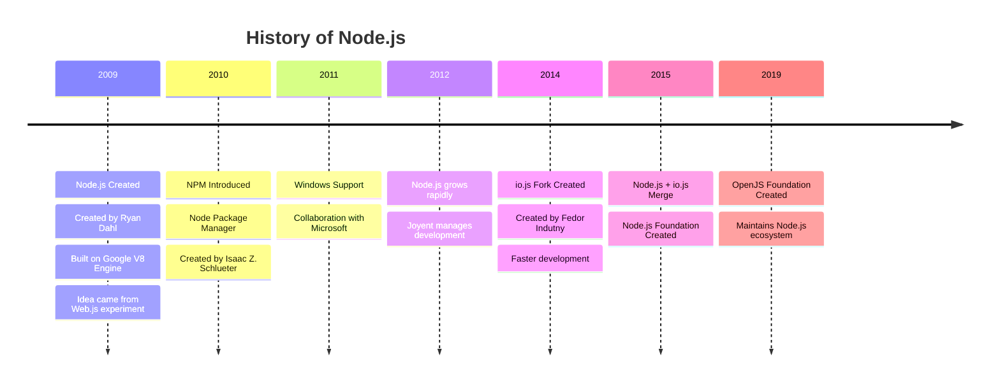

---

# 🧠 Node.js History Diagram



---

# 📦 Episode-01 README

## Introduction to Node.js

---

# 🚀 What is Node.js

**Node.js** is an **open-source, cross-platform JavaScript runtime environment** that allows developers to run **JavaScript outside the browser**.

It is built on **V8 JavaScript Engine** which is developed by **Google**.

Node.js is mainly used for:

* Backend development
* APIs
* Real-time applications
* Microservices
* Streaming services

---

# 🧠 Why Node.js Was Created

Before Node.js, web servers like **Apache HTTP Server** worked using a **blocking request model**.

Problem with this approach:

* Each request creates a **new thread**
* High memory consumption
* Slow performance for large traffic

To solve this, **Ryan Dahl** created Node.js in **2009**.

---

# 🌐 Web.js (Early Experiment)

Before Node.js, Ryan Dahl experimented with a project called **Web.js**.

Goal:

👉 Build a **web server using JavaScript**

Initially he tried using **SpiderMonkey** (JavaScript engine by **Mozilla**).

But problems were:

* Slow execution
* Not optimized for server workloads
* Poor asynchronous handling

---

# ⚡ Introduction of V8 Engine

In **2008**, **Google** introduced the **V8 JavaScript Engine** for **Google Chrome**.

Features of V8:

* JIT Compilation
* Converts JS → Machine Code
* Extremely fast execution

Ryan Dahl used **V8** to build **Node.js**.

---

# 🏢 Joyent Supports Node.js

The company **Joyent** adopted Node.js and funded development.

Joyent:

* Hosted Node.js infrastructure
* Managed early development
* Helped grow the community

---

# 📦 NPM (Node Package Manager)

In **2010**, **npm** was introduced.

Created by **Isaac Z. Schlueter**.

Purpose:

* Install libraries
* Manage dependencies
* Share open-source packages

Example:

```bash
npm install express
```

Today npm is the **largest package ecosystem in the world**.

---

# 🪟 Windows Support

Initially Node.js worked only on **Linux & Mac**.

In **2011**, **Microsoft** collaborated with the Node.js community to bring **Windows support**.

This helped Node.js grow massively among developers.

---

# 🔀 io.js Fork

In **2014**, Node.js development slowed down.

So **Fedor Indutny** created a fork called **io.js**.

Goals:

* Faster releases
* Latest V8 updates
* Community governance

---

# 🤝 Node.js + io.js Merge

In **2015**, Node.js and io.js merged together.

The **Node.js Foundation** was created to manage the project.

---

# 🌍 OpenJS Foundation

In **2019**, the **Node.js Foundation** merged with **JS Foundation**.

This created the **OpenJS Foundation**.

Now this foundation maintains Node.js.

---

# ⚙️ Key Features of Node.js

### 1️⃣ Non-Blocking I/O

Handles thousands of requests efficiently.

### 2️⃣ Event-Driven Architecture

Uses an **event loop**.

### 3️⃣ Single Threaded

But handles multiple concurrent operations.

### 4️⃣ Fast Execution

Powered by **V8 Engine**.

---

# 📊 Simple Architecture

```
Client Request
    │
    ▼
Node.js Server
(Event Loop)
    │
    ▼
Non Blocking I/O
    │
    ▼
Database / File System
```

---
